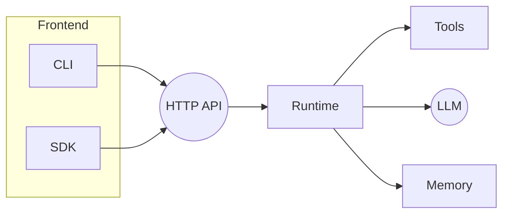

# Agentry Cloud Architecture

This document outlines the planned cloud deployment model for Agentry.

## Overview

Agentry exposes a minimal HTTP API backed by the Go runtime. Clients (CLI, SDK, or other services) send requests to the API which orchestrates tools and models.

```
[Client] -> [HTTP API] -> [Agent Runtime] -> [Tools/LLM]
                      -> [Memory]
```



## Repository Layout

```
.
├── cmd/           # CLI entrypoints
├── internal/      # core runtime packages
├── ts-sdk/        # TypeScript SDK
├── design/        # architecture notes
├── examples/      # sample configs and data
├── tests/         # Go test suites
└── README-cloud.md
```

This layout may evolve as the distributed scheduler and sandbox features mature.

## Building the Dashboard

The web dashboard lives under `ui/web` and uses SvelteKit.

```bash
cd ui/web
npm install
npm run build
```

The build output in `ui/web/dist` is embedded into the hub and served at `/` when running `agentry serve --metrics`.

## HTTP API

Agentry exposes a simple JSON API. Agents are identified by UUIDs which map to
persistent state in the configured `memstore` backend.

### `POST /spawn`

Create a new agent from the `default` template. Returns the assigned `agent_id`.

```
curl -X POST http://localhost:8080/spawn
```

Response:

```json
{"agent_id": "<uuid>"}
```

### `POST /invoke`

Send a message to an agent. Set `stream` to `true` for an SSE stream.

```json
{
  "agent_id": "<uuid>",
  "input": "hello",
  "stream": false
}
```

### `POST /kill`

Persist the agent's state and remove it from memory.

```json
{
  "agent_id": "<uuid>"
}
```
