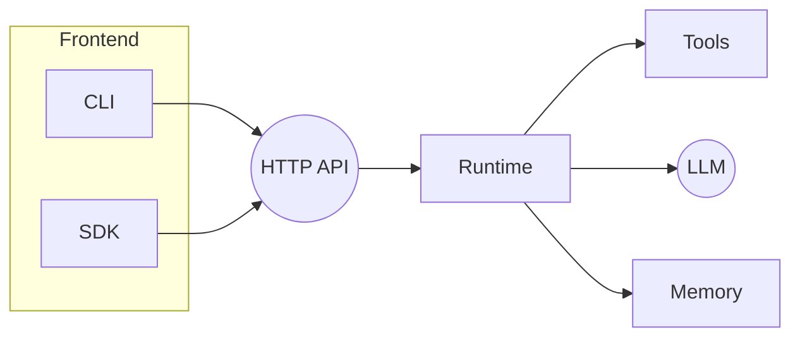

# Agentry Cloud Architecture

This document outlines the planned cloud deployment model for Agentry.

## Overview

Agentry exposes a minimal HTTP API backed by the Go runtime. Clients (CLI, SDK, or other services) send requests to the API which orchestrates tools and models.

```
[Client] -> [HTTP API] -> [Agent Runtime] -> [Tools/LLM]
                      -> [Memory]
```



## Repository Layout

```
.
├── cmd/           # CLI entrypoints
├── internal/      # core runtime packages
├── ts-sdk/        # TypeScript SDK
├── design/        # architecture notes
├── examples/      # sample configs and data
├── tests/         # Go test suites
└── README-cloud.md
```

This layout may evolve as the distributed scheduler and sandbox features mature.
