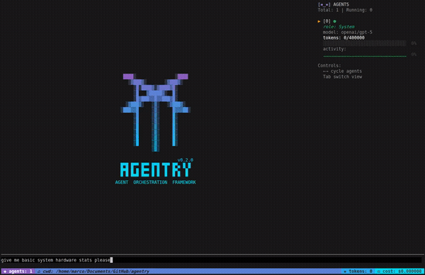

```
                                 
                                 
    ████▒               ▒████    
      ▒▓███▓▒       ▒▓███▓▒      
        ▒█▒████▓▒▓████▓█▒        
        ▒█   ▓█████▓▒  █▒        
        ▒█▓███▓▓█▓▓███▓█▒        
     ▒▓███▓▒   ▒▓▒   ▒▓███▓▒     
   ▒███▓▓█     ▒▓▒     █▓▓▓██▒   
        ▒█     ▒▓▒     █▒        
        ▒█     ▒▓▒     █▒        
        ▒█     ▒▓▒     █▒        
        ▒█     ▒▓▒     █▒        
        ▒█     ▒▓▒     █▒        
        ▒█     ▒▓▒     █▒        
               ▒▓▒               
                                 
                         v0.2.0  
   █▀█ █▀▀ █▀▀ █▀█ ▀█▀ █▀▄ █ █   
   █▀█ █ █ █▀▀ █ █  █  █▀▄  █    
   ▀ ▀ ▀▀▀ ▀▀▀ ▀ ▀  ▀  ▀ ▀  ▀    
 AGENT  ORCHESTRATION  FRAMEWORK 
```

# Agentry – Minimal, Performant Go AI-Agent Runtime

**⚠️ CRITICAL: READ [CRITICAL_INSTRUCTIONS.md](./CRITICAL_INSTRUCTIONS.md) FIRST ⚠️**



Agentry is a production-ready **agent runtime** written in Go. Earlier experimental TypeScript/JS client code has been removed – the focus is now a lean, fast, embeddable Go runtime and CLI.

For the upcoming cloud deployment model, see [README-cloud.md](./README-cloud.md).

---

| 🚩 **Pillar**        | ✨ **v1.0 Features**                                     |
| -------------------- | -------------------------------------------------------- |
| 🧰 **Tool System**   | 40+ built-in tools (file ops, delegation, network, LSP) |
| 🤹‍♂️ **Sub-agents**    | Team / delegation tools (`agent`, `team_status`, etc.)  |
| 🧠 **Memory**        | Conversation + pluggable vector store (qdrant/faiss)    |
| 🕵️‍♂️ **Tracing**       | Structured events, JSONL dump                          |
| ⚙️ **Config**        | `.agentry.yaml` declarative models + tools               |
| 🧪 **Evaluation**    | CLI `agentry eval` + mock vs real model switching        |
| � **Costs**         | Live token & cost accounting                            |
---

## 📦 Installation

Prebuilt binaries are available on [GitHub Releases](https://github.com/marcodenic/agentry/releases).

### Homebrew (macOS/Linux)

```bash
brew tap marcodenic/agentry
brew install agentry
```

### Scoop (Windows)

```powershell
scoop bucket add agentry https://github.com/marcodenic/agentry
scoop install agentry
```

### Debian

```bash
wget https://github.com/marcodenic/agentry/releases/download/vX.Y.Z/agentry_X.Y.Z_amd64.deb
sudo dpkg -i agentry_X.Y.Z_amd64.deb
```

### Build from Source

```bash
# Install to $GOPATH/bin (recommended)
go install github.com/marcodenic/agentry/cmd/agentry@latest

# Or clone and install from the repository
git clone https://github.com/marcodenic/agentry.git
cd agentry
go install ./cmd/agentry
```

⚠️ **Note**: Avoid running `go build` in the repository root as it creates build artifacts that shouldn't be committed. Use `go install` instead to properly install the binary to your `$GOPATH/bin` directory.

---

## 🚀 Quick Start

```bash
go install github.com/marcodenic/agentry/cmd/agentry@latest

# Terminal UI (default)
agentry                 # launches TUI
agentry tui --config examples/.agentry.yaml

# JSON-first automation
agentry invoke "summarize README"
agentry invoke --agent coder "add a Makefile target"
agentry team roles
agentry team spawn --name coder --role coder
agentry team call --agent coder --input "print hello in bash"
agentry memory export --out mem.json
```

The `examples/.agentry.yaml` file contains a ready-to-use configuration for these commands.

Core subcommands (run `agentry help` for full help):

- `tui` (interactive; default when no command provided)
- `invoke` (one-shot; optional `--agent` and `--trace`)
- `team` (roles, list, spawn, call, stop)
- `memory` (export, import)
- `cost`, `eval`, `analyze`, `pprof`, `version`

Agents run until completion; there is no fixed iteration cap.

```

Pass `--resume-id name` to load a saved session and `--save-id name` to persist after each run.
Use `--checkpoint-id name` to continuously snapshot the run loop and resume after a crash.

The `tui` command launches a split-screen interface:

```
+-------+-----------------------------+
| 🛠️ Tools | 💬 Chat / Memory           |
+-------+-----------------------------+
```

Run `agentry tui --config examples/.agentry.yaml` to start the interface. There is no separate `--team` flag; simply type `/spawn <name>` to add a new agent pane. For example, `/spawn coder` starts an additional "coder" agent. All agents share the same chat window and can be dispatched to remote nodes in your Agentry cluster.

Supported chat commands:

- `/spawn <name>` – create a new agent pane
- `/switch <prefix>` – focus an agent by ID prefix
- `/stop <prefix>` – stop an agent while keeping history
- `/converse <n> <topic>` – launch a side conversation between `n` agents

---

### 🎨 Themes & Keybinds

Create a `theme.json` file to customise colours and keyboard shortcuts. Agentry
looks for the file in the current directory and its parents, falling back to
`$HOME/.config/agentry/theme.json`. Settings override the built‑in defaults.

```json
{
  "userBarColor": "#00FF00",
  "aiBarColor": "#FF00FF",
  "keybinds": {
    "quit": "ctrl+c",
    "toggleTab": "tab",
    "submit": "enter"
  }
}
```

---

## 🧰 Built-in Tools

Agentry ships with a collection of safe builtin tools. They become available to the agent when listed in your `.agentry.yaml` file:

```yaml
tools:
  - name: echo # 🔁 repeat a string
    type: builtin
  - name: ping # 📡 ping a host
    type: builtin
  - name: powershell # 🖥️ run PowerShell commands (Windows)
    type: builtin
  - name: cmd # 🖥️ run cmd.exe commands (Windows)
    type: builtin
  - name: bash # 🖥️ run bash commands (Unix/Linux/macOS)
    type: builtin
  - name: sh # �️ run shell commands (Unix/Linux/macOS)
    type: builtin
  - name: branch-tidy # 🧹 clean up old local Git branches
    type: builtin
  - name: fetch # 🌍 download content from a URL
    type: builtin
  - name: patch # 🩹 apply a unified diff
    type: builtin
  - name: agent # 🤖 delegate tasks to another agent
    type: builtin
  - name: mcp # 🎮 connect to MCP servers
    type: builtin
  - name: lsp_diagnostics # 🩺 run language diagnostics (Go:gopls, TS:tsc, Py:pyright, Rust:cargo, JS:eslint)
    type: builtin
```

### 🩺 Diagnostics (LSP)

Use `lsp_diagnostics` to surface issues across common languages (Go, TypeScript/JS, Python, Rust). Output is JSON (file, line, col, code, severity, message). Missing language tools are skipped gracefully.

### 🎯 Advanced File Operations

Agentry includes line‑precise, atomic file editing tools (no shell redirection needed):

```yaml
tools:
  - name: read_lines # 📖 read specific lines from files with line-precise access
    type: builtin
  - name: edit_range # ✏️ replace a range of lines atomically
    type: builtin
  - name: insert_at # ➕ insert lines at specific positions
    type: builtin
  - name: search_replace # 🔍 search and replace with regex support
    type: builtin
  - name: fileinfo # ℹ️ get comprehensive file information
    type: builtin
  - name: view # 👀 enhanced file viewing with line numbers
    type: builtin
  - name: create # 📝 create new files with content
    type: builtin
```

#### Example Usage

**Reading specific lines:**

```json
{
  "tool": "read_lines",
  "args": {
    "path": "src/main.go",
    "start_line": 10,
    "end_line": 20
  }
}
```

**Atomic line range editing:**

```json
{
  "tool": "edit_range",
  "args": {
    "path": "src/main.go",
    "start_line": 15,
    "end_line": 17,
    "content": "// New implementation\nfunc main() {\n    fmt.Println(\"Hello World\")"
  }
}
```

**Regex search and replace:**

```json
{
  "tool": "search_replace",
  "args": {
    "path": "src/main.go",
    "search": "fmt\\.Println\\(([^)]+)\\)",
    "replace": "log.Println($1)",
    "regex": true
  }
}
```

### File Operation Strategy

Preferred (safe) tools:
- View/read: `view`, `read_lines`
- Edit/insert: `edit_range`, `insert_at`, `search_replace`, `edit`
- Create: `create`, `write`
- Inspect: `fileinfo`
- Discover: `find`, `glob`, `grep`, `ls`, `project_tree`

Shell tools (`bash`, `sh`, `powershell`, `cmd`) remain available for everything else.

Use the `mcp` tool to connect to Multi-User Connection Protocol servers. Set its
address in your YAML config and the agent can send MCP commands and read the
responses.

### 📋 Agent Delegation

Use `agent` to delegate work to another role (e.g. `coder`, `researcher`). Add the tool, spawn or reference the role, then:

```bash
agentry invoke --agent coder "write unit tests"
```

### OpenAPI & MCP Specs

Generate tool specs at runtime from OpenAPI or simple MCP schemas (see `examples/echo-openapi.yaml`, `examples/ping-mcp.json`).

> **🪟 Windows users:** Agentry works out-of-the-box on Windows 10+ with PowerShell installed.

---

## 🧑‍💻 Try it Live

```bash
agentry tui --config examples/.agentry.yaml
agentry invoke "say hi"
```

---

## 🦾 End-to-End Example (CLI)

You can test the core functionality using the CLI modes:

```bash
agentry tui --config examples/.agentry.yaml
agentry invoke --agent coder "create hello.go"
```

---

## 🛠️ Dev / REPL Tricks

### 🤖 Multi-agent conversations

The `converse` command spawns multiple sub-agents that riff off one another. This was originally REPL-only, but the TUI now supports these conversations without any special flags.

```bash
converse 3 Pick a favourite movie, just one, then discuss as a group.
```

The first number selects how many agents join the chat. Any remaining text becomes the opening message. If omitted, a generic greeting is used.

Inside the TUI, you can create additional agents on the fly:

```bash
/spawn researcher "gather background info"
```

### 💾 Saving & Resuming

Add a `memory` entry to your `.agentry.yaml` to enable persistence. The value uses a URI scheme to select the backend:

```yaml
# SQLite database
memory: sqlite:mem.db

# JSON file
# memory: file:mem.json

# In-memory (ephemeral)
# memory: mem:

# Session TTL (optional)
store: path/to/db.sqlite
# automatically remove sessions after one week
session_ttl: 168h
# interval between cleanup sweeps (default 1h)
session_gc_interval: 1h
```

Run the CLI with `--resume-id myrun` to load a snapshot before running and `--save-id myrun` to save state after each run. `--checkpoint-id myrun` continuously saves intermediate steps so sessions can be resumed.

### 📚 Vector Store

Example config:

```yaml
vector_store:
  type: qdrant
  url: http://localhost:6333
  collection: agentry
```

Supported: `qdrant`, `faiss`, in‑memory.

### ♻️ Reusing Roles

Role templates live under `templates/roles/`. Each YAML file defines an agent
name, prompt, and allowed tools:

```yaml
name: coder
prompt: |
  You are an expert software developer.
tools:
  - bash
  - patch
```

The default system prompt for solo mode lives in `templates/roles/agent_0.yaml`.

---

## ⚙️ Environment Configuration

Copy `.env.example` to `.env.local` and fill in `OPENAI_API_KEY` to enable real OpenAI calls. The file is loaded automatically on startup and during tests.

To run evaluation with the real model:

```bash
OPENAI_API_KEY=your-key agentry eval --config my.agentry.yaml
```

When the real model is active, the CLI uses `tests/openai_eval_suite.json` so the assertions match ChatGPT's typical response.

Evaluation results are printed to the console when using this mode.

If no key is present, the built-in mock model is used.

---

## 📁 Configuration Management

Agentry uses YAML configuration files to define models, tools, and behavior. The configuration system has been simplified to use cost-effective models and clear delegation patterns.

### Main Configuration Files
- **`.agentry.yaml`**: Primary configuration for production use
- **`examples/.agentry.yaml`**: Reference configuration for users

### Configuration Documentation
- **[CONFIG_GUIDE.md](docs/CONFIG_GUIDE.md)**: Complete guide to all configuration files
- **[CONFIG_CLEANUP_SUMMARY.md](CONFIG_CLEANUP_SUMMARY.md)**: Recent improvements and standards

### Validation
```bash
# Validate all configuration files
./scripts/validate-configs.sh
```

### Key Principles
- **Agent 0**: Uses gpt-5 for system/orchestrator duties
- **Specialist Agents**: Use appropriate models defined in role templates
- **No Complex Routing**: Simple model-per-agent approach
- **Always Include**: The `agent` tool for delegation capabilities

### 🚀 Extended Capabilities (Roadmap)

Agentry supports additional specialized agent types and tools for complex workflows:

#### 🤝 User Interaction
- **`ask_user` tool**: Pause execution to collect user confirmation, feedback, or guidance
- **Interactive Workflows**: Long-running tasks that benefit from human oversight and decision-making
- **Confirmation Dialogs**: Critical actions that require explicit user approval

#### 🎨 Image & Design Generation
- **Designer Agent**: Specialized role for visual creation and UI/UX design
- **Image Generation**: Integration with DALL-E, Stable Diffusion, and other generative AI models
- **Visual Tools**: Create diagrams, mockups, and visual assets programmatically

#### 🔍 Fact-Checking & Citation
- **Verification Agent**: Dedicated fact-checking with source attribution
- **Citation Tracking**: Automatic source referencing and credibility assessment
- **Information Validation**: Cross-reference claims across multiple reliable sources

#### 🧠 Enhanced Memory
- **Semantic Search**: Vector-based memory retrieval across sessions and projects
- **Long-term Knowledge**: Persistent knowledge base that agents can reference and update
- **Context Preservation**: Maintain relevant information across extended agent workflows

These capabilities build on Agentry's solid foundation of team coordination, shared memory, and tool orchestration.

---

## 🧪 Testing & Validation

- For the canonical, machine-readable checklist, see [TEST.md](./TEST.md).
- For a human-friendly guide, see [docs/testing.md](./docs/testing.md).

---

## 🧪 Testing & Development

Run all Go tests:

```bash
go test ./...
```

Build & run TUI:

```bash
go install ./cmd/agentry
agentry tui --config examples/.agentry.yaml
```

## 🪟 Windows Setup

**Run Go tests:**

```powershell
go test ./... -v -short
```

**Run all tests, including integration:**

```powershell
go test ./... -v -tags=integration
```

## ️ Tool Scaffolding

To create a new builtin tool:

1. Copy a small existing example (e.g. one of the simple tools in `internal/tool/`).
2. Implement your logic (keep it fast, deterministic, side‑effect aware).
3. Expose a `Spec()` describing name, description, input schema.
4. Register in an `init()` so it auto-adds to the builtin registry.

Keeping this manual (vs a generator) ensures each addition is reviewed for security and auditability. A future helper may scaffold boilerplate, but clarity beats magic for now.

## 🔒 Security & Auditing

List allowed tools in your configuration to enable granular permissions:

```yaml
permissions:
  tools:
    - echo
    - ls
```

Set `AGENTRY_CONFIRM=1` to require confirmation before overwriting files. If `AGENTRY_AUDIT_LOG` points to a path, tool executions are appended in JSONL format.

## 📊 Observability

Add `metrics: true` to expose Prometheus counters at `/metrics`. Specify a `collector:` address to forward spans via OTLP:

```yaml
metrics: true
collector: localhost:4318
```

The web dashboard visualises these metrics and traces live.

## 🤝 Contributing

We welcome contributions! Please see [CONTRIBUTING.md](CONTRIBUTING.md) for development guidelines, including:

- How to set up your development environment
- Proper use of `go install` vs `go build`
- Testing procedures
- Code style guidelines
- How to submit pull requests

> **Repository Hygiene**: keep the root clean (see `docs/dev/AGENTS.md`).

For questions or discussions, please open an issue on GitHub.

## 📄 License

This project is licensed under the MIT License. See [LICENSE](LICENSE) for details.