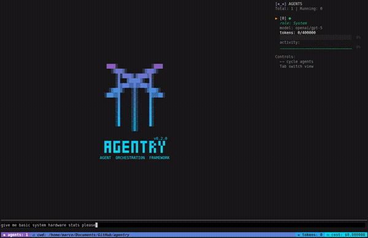

# Agentry

```
    ████▒               ▒████    
      ▒▓███▓▒       ▒▓███▓▒      
        ▒█▒████▓▒▓████▓█▒        
        ▒█   ▓█████▓▒  █▒        
        ▒█▓███▓▓█▓▓███▓█▒        
     ▒▓███▓▒   ▒▓▒   ▒▓███▓▒     
   ▒███▓▓█     ▒▓▒     █▓▓▓██▒   
        ▒█     ▒▓▒     █▒        
        ▒█     ▒▓▒     █▒        
        ▒█     ▒▓▒     █▒        
        ▒█     ▒▓▒     █▒        
        ▒█     ▒▓▒     █▒        
        ▒█     ▒▓▒     █▒        
               ▒▓▒               
                         v0.2.0  
```

**A local-first AI agent runtime with a built-in TUI for development automation.**



## Overview

Agentry is a minimal Go binary that provides a single intelligent agent with parallel search capabilities. Unlike complex multi-agent orchestration systems, Agentry follows the proven model: one smart agent that does the work, with the ability to spawn ephemeral read-only sub-agents for parallel search when needed.

**Key Features:**
- 🚀 Fast startup, minimal dependencies
- 🖥️ Built-in TUI with real-time streaming and reasoning display
- 🔧 Permission-gated tools defined in `.agentry.yaml`
- 🤖 Multi-provider LLM support (OpenAI, Anthropic Claude, Google)
- 📊 Live token/cost accounting with model pricing cache
- 🔍 Structured tracing and debug logging

## Install

**Prerequisites:** Go 1.23+

```bash
go install github.com/marcodenic/agentry/cmd/agentry@latest
```

Or build from source:
```bash
git clone https://github.com/marcodenic/agentry.git
cd agentry
make build
```

## Quick Start

```bash
# Start TUI (default)
agentry

# Direct prompt execution
agentry "fix the failing tests"
agentry summarize the README

# Update model pricing cache
agentry refresh-models

# Show version
agentry --version
```

## Configuration

**Project config:** `.agentry.yaml` in your repo root  
**Environment:** Copy `.env.example` to `.env.local` and set your API keys:

```bash
OPENAI_API_KEY=sk-...
ANTHROPIC_API_KEY=sk-ant-...
GOOGLE_API_KEY=...
```

**Useful flags:**
| Flag | Description |
|------|-------------|
| `--config PATH` | Custom config file path |
| `--debug` | Enable verbose debug logging |
| `--max-iter N` | Limit agent iterations (0=unlimited) |
| `--http-timeout SEC` | HTTP timeout in seconds (default 300) |
| `--allow-tools a,b` | Restrict to only specified tools |
| `--deny-tools a,b` | Remove specific tools from available set |
| `--disable-tools` | Disable tool filtering (allow all) |

## Built-in Tools

Tools are enabled by listing them in your `.agentry.yaml`. Categories:

| Category | Tools |
|----------|-------|
| **File Viewing** | `view`, `read_lines`, `fileinfo` |
| **File Editing** | `create`, `write`, `edit`, `edit_range`, `insert_at`, `search_replace`, `patch` |
| **Search** | `ls`, `find`, `grep`, `glob`, `project_tree` |
| **Shell** | `bash`, `sh`, `cmd`, `powershell` |
| **Networking** | `fetch`, `api`, `download`, `read_webpage`, `web_search` |
| **Delegation** | `agent` (ephemeral sub-agents for parallel search) |
| **TODO Management** | `todo_add`, `todo_list`, `todo_get`, `todo_update`, `todo_delete` |
| **Diagnostics** | `lsp_diagnostics`, `sysinfo`, `ping`, `echo` |
| **Protocol** | `mcp` (Model Context Protocol) |

## TUI Navigation

| Key | Action |
|-----|--------|
| `Ctrl+N/P` | Navigate history |
| `Home/End` | Jump to start/end |
| `Ctrl+F` | Toggle follow mode |
| `Ctrl+H` | Toggle help |
| `Ctrl+C` | Cancel/Exit |

## Tracing & Costs

- Structured JSONL trace events for every run
- Live token counting (input/output) with estimated cost
- Model pricing automatically refreshed from models.dev

## Development

```bash
# Build
make build

# Run tests
go test ./...

# Run with debug logging
./agentry --debug

# Format check
gofmt -l .
```

## Architecture

Agentry follows the **single agent + parallel search** model:

```
User Request
     ↓
┌─────────────────────────────────────┐
│           Main Agent                │
│  - reads/writes files               │
│  - runs commands                    │
│  - plans and iterates               │
└─────────────┬───────────────────────┘
              │ "agent" tool (parallel search)
    ┌─────────┼─────────┐
    ↓         ↓         ↓
┌───────┐ ┌───────┐ ┌───────┐
│search │ │search │ │search │  ← Ephemeral, stateless
│agent  │ │agent  │ │agent  │  ← Read-only tools only
└───────┘ └───────┘ └───────┘
```

## License

MIT - see [LICENSE](LICENSE)
