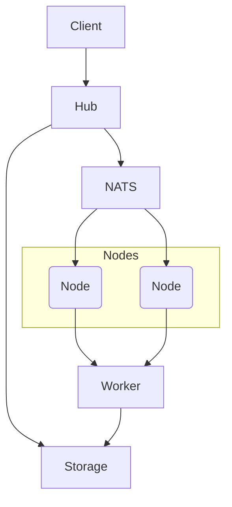

# Distributed Architecture

Agentry Cloud uses a hub-and-node model that coordinates work across multiple services. This layout allows agent tasks to scale horizontally while keeping the runtime lightweight.

## Components

- **Hub** – central gRPC/HTTP service responsible for accepting requests, storing agent templates and publishing work to the queue.
- **Nodes** – workers that subscribe to the queue and execute agent steps. Nodes are stateless and can scale up or down.
- **Worker Processes** – optional long‑running jobs that handle CPU/GPU intensive operations.
- **NATS** – message bus used for task scheduling and broadcast events.
- **Persistent Storage** – database or object store for agent state, traces and logs.

## Workflow

1. A client calls the hub to `spawn` or `invoke` an agent.
2. The hub stores metadata and publishes a task on NATS.
3. An available node pulls the task and runs the agent step.
4. Results are sent back through the hub and persisted.
5. Heavy tasks may be offloaded to dedicated worker processes.

## Scaling

- Add more nodes to increase concurrency; they connect automatically to NATS and the hub.
- Use NATS queue groups to distribute tasks evenly.
- Workers can be specialised for GPU tasks or sandboxed execution.
- The hub remains mostly stateless so it can be replicated behind a load balancer.

