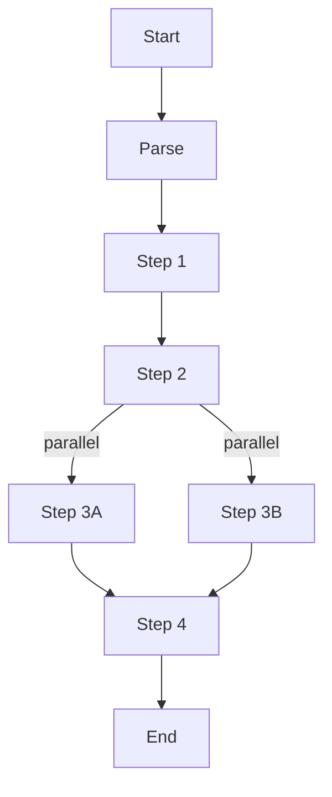

# Flow DSL

The Flow DSL provides a declarative way to orchestrate multi-step agent workflows using YAML files. A flow is executed with `agentry flow <path>` and may spawn additional agents or call tools in sequence.

## Goals

- **Declarative** – describe prompts and tool usage without writing Go code.
- **Composable** – steps can include sub-flows or spawn new agents.
- **Portable** – YAML definitions can be shared and version controlled.

## Basic Structure

```yaml
steps:
  - prompt: |
      You are a research assistant. Summarise the topic.
    tool: web-search
    assign: search
  - if: search.results
    spawn: summariser
  - parallel:
      - { tool: summariser, input: "{{search.results}}" }
      - { tool: translator, input: "{{search.summary}}" }
  - end
```

## Execution Workflow

1. The CLI parses the YAML into a `FlowSpec`.
2. Each `step` is executed sequentially unless a `parallel` block is encountered.
3. Output from steps is stored in a context and referenced via `{{ placeholders }}`.
4. `spawn` steps run sub-agents concurrently and merge their results back into the flow context.



## Future Features

- Conditionals (`if`, `unless`) for branching logic.
- Loop constructs for iterative tasks.
- Integration with the distributed scheduler so steps can run on remote nodes.


