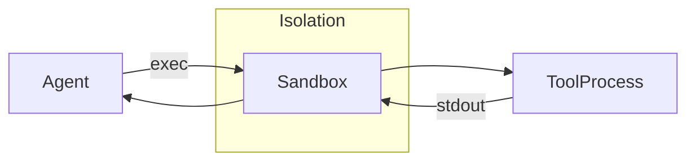

# Sandbox Architecture

Tools and plugins may execute untrusted code. The sandbox isolates these processes from the host system while still allowing them to interact with the agent runtime.

## Goals

- **Security** – prevent malicious code from affecting the rest of the system.
- **Reproducibility** – run tools in clean environments with limited side effects.
- **Flexibility** – support local OS sandboxes or container runtimes.

## Approach

1. The agent launches a sandbox process with the desired command.
2. A restricted working directory is created and mounted as the tool's root.
3. Syscall filtering (seccomp) and read‑only mounts limit access to the host.
4. Network access can be disabled or proxied through the hub.
5. Output is streamed back to the agent and then to the client.

## Typical Workflow

1. Agent prepares the tool command and allowed files.
2. Sandbox initialises the environment, applying cgroups or container limits.
3. The tool runs to completion; stdout and stderr are captured.
4. Results are returned and the temporary directory is removed.

## Future Work

- Policy engine for per-tool permissions.
- Remote sandbox execution on specialised worker nodes.

